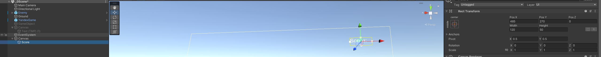
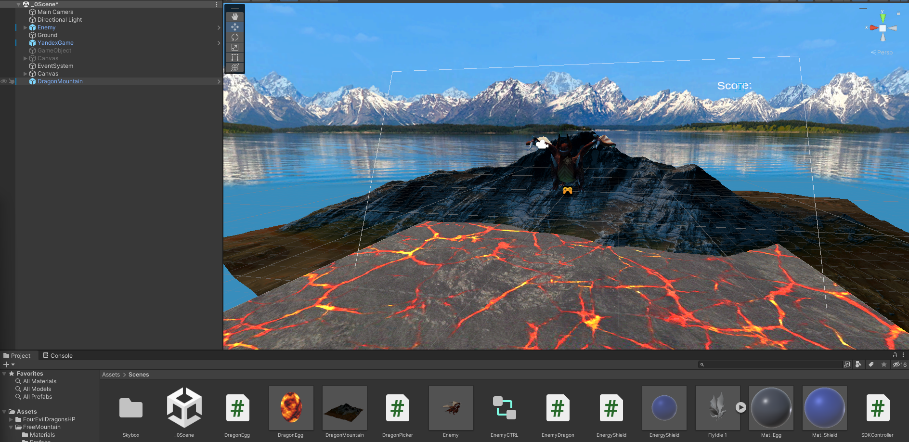
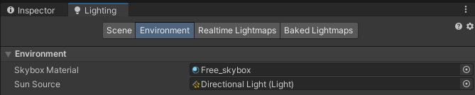
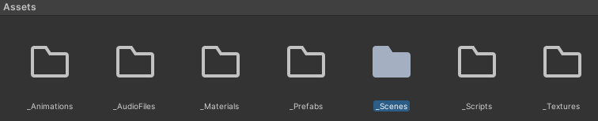
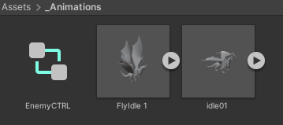
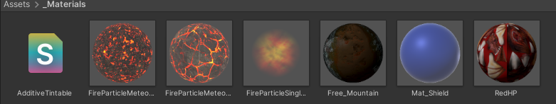
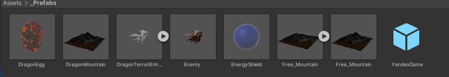
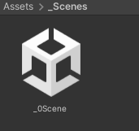
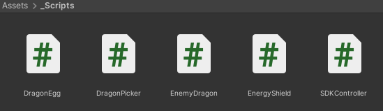
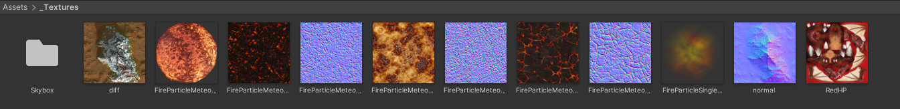

# Лабораторная работа № 3 Реализация интерфейса пользователя
Отчет по лабораторной работе №3 выполнил:
- Строшков Артем Валерьевич
- РИ-300004

Отметка о выполнении заданий (заполняется студентом):

| Задание | Выполнение | Баллы |
| ------ | ------ | ------ |
| Задание 1 | * |  |
| Задание 2 | * |  |
| Задание 3 | # |  |

знак "*" - задание выполнено; знак "#" - задание не выполнено;

Работу проверили:
- к.т.н., доцент Денисов Д.В.
- к.э.н., доцент Панов М.А.
- ст. преп., Фадеев В.О.

[](https://nodesource.com/products/nsolid)

[](https://travis-ci.org/joemccann/dillinger)

Структура отчета

- Данные о работе: название работы, фио, группа, выполненные задания.
- Цель работы.
- Задание 1.
- Код реализации выполнения задания. Визуализация результатов выполнения (если применимо).
- Задание 2.
- Код реализации выполнения задания. Визуализация результатов выполнения (если применимо).
- Задание 3.
- Код реализации выполнения задания. Визуализация результатов выполнения (если применимо).
- Выводы.
- ✨Magic ✨

## Цель работы
Создание интерактивного приложения и изучение принципов интеграции в него игровых сервисов.

## Задание 1
### Используя видео-материалы практических работ 1-5 повторить реализацию игровых механик:
### – 1 Практическая работа «Реализация механизма ловли объектов».
### – 2 Практическая работа «Реализация графического интерфейса с добавлением счетчика очков».

#### Ход работы (задание 1).
1) Реализовать управление энергетическими щитами с помощью движения мыши

```cs

   void Update() {
        Vector3 mousePos2D = Input.mousePosition;
        mousePos2D.z = -Camera.main.transform.position.z;
        Vector3 mousePos3D = Camera.main.ScreenToWorldPoint(mousePos2D);
        Vector3 pos = this.transform.position;
        pos.x = mousePos3D.x;
        this.transform.position = pos;
    }

```

2) Реализовать "ловлю" объекта

```cs

    private void OnCollisionEnter(Collision coll) {
        GameObject Collided  = coll.gameObject;
        if(Collided.tag == "Dragon Egg"){
            Destroy(Collided);
        }
    }

```


3) Добавить счетчик очков и настроить его
 


4) Изменить скрипт ловли объектов

```cs

using System.Collections;
using System.Collections.Generic;
using UnityEngine;
using TMPro;

public class EnergyShield : MonoBehaviour
{
    public TextMeshProUGUI scoreGT;
    void Start() {
        GameObject scoreGO = GameObject.Find("Score");
        scoreGT = scoreGO.GetComponent<TextMeshProUGUI>();
        scoreGT.text = "0";
    }
    void Update() {
        Vector3 mousePos2D = Input.mousePosition;
        mousePos2D.z = -Camera.main.transform.position.z;
        Vector3 mousePos3D = Camera.main.ScreenToWorldPoint(mousePos2D);
        Vector3 pos = this.transform.position;
        pos.x = mousePos3D.x;
        this.transform.position = pos;
    }

    private void OnCollisionEnter(Collision coll) {
        GameObject Collided  = coll.gameObject;
        if(Collided.tag == "Dragon Egg"){
            Destroy(Collided);
        }
        int score = int.Parse(scoreGT.text);
        score += 1;
        scoreGT.text = score.ToString();
    }
}

```

## Задание 2
### Используя видео-материалы практических работ 1-5 повторить реализацию игровых механик:
### – 3 Практическая работа «Уменьшение жизни. Добавление текстур».
### – 4 Практическая работа «Структурирование исходных файлов в папке».

#### Ход работы (задание 2).
1) Скачать и импортировать ассет Autumn Mountain
2) Изменить скрипт DragonEgg(Изменения метода Update):

```cs

    // Update is called once per frame
    void Update()
    {
        if (transform.position.y < bottomY){
            Destroy(this.gameObject);
            DragonPicker apScript = Camera.main.GetComponent<DragonPicker>();
            apScript.DragonEggDestroyed();
        }
    }

```

3) Добавить в скрипт DragonPicker учет отсавшихся жизней(щитов). Если щиты заканчиваются, то сцена перезагржуается


```cs

using System.Collections;
using System.Collections.Generic;
using UnityEngine;
using UnityEngine.SceneManagement;


public class DragonPicker : MonoBehaviour
{
    public GameObject energyShieldPrefab;
    public int numEnergyShield = 3;
    public float energyShieldBottomY = -6f;
    public float energyShieldRadius = 1.5f;

    public List<GameObject> shieldList;

    // Start is called before the first frame update
    void Start()
    {
        shieldList = new List<GameObject>();
        for (int i = 1; i <= numEnergyShield; i++){
            GameObject tShieldGo = Instantiate<GameObject>(energyShieldPrefab);
            tShieldGo.transform.position = new Vector3(0, energyShieldBottomY, 0);
            tShieldGo.transform.localScale = new Vector3(1*i, 1*i, 1*i);
            shieldList.Add(tShieldGo);
        }
    }

    // Update is called once per frame
    void Update()
    {
        
    }

    public void DragonEggDestroyed(){
        // GameObject[] tDragonEggArray = GameObject.FindGameObjectsWithTag("Dragon Egg");
        // foreach (GameObject tGI in tDragonEggArray){
        //     Destroy(tGI);
        // }
        int shieldIndex = shieldList.Count - 1;
        GameObject tShieldGo = shieldList[shieldIndex];
        shieldList.RemoveAt(shieldIndex);
        Destroy(tShieldGo);

        if (shieldList.Count == 0) {
            SceneManager.LoadScene("_0Scene");
        }
    }
}


```

4) Добавить на сцену готовый префаб горы и пак префабов неба, настроить их




5) Создать новые папки



6) Распределить все элементы по тематическим папкам








## Задание 3
### Используя видео-материалы практических работ 1-5 повторить реализацию игровых механик:
### 5 Практическая работа «Интеграция игровых сервисов в готовое приложение».

#### Ход работы (задание 3).


## Выводы
- Начал работу над Dragon Picker, научился работать с сервисом "Яндекс игры" и sdk для них

